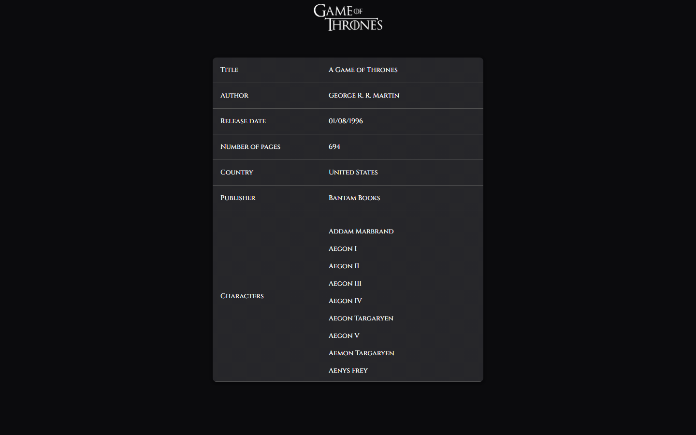
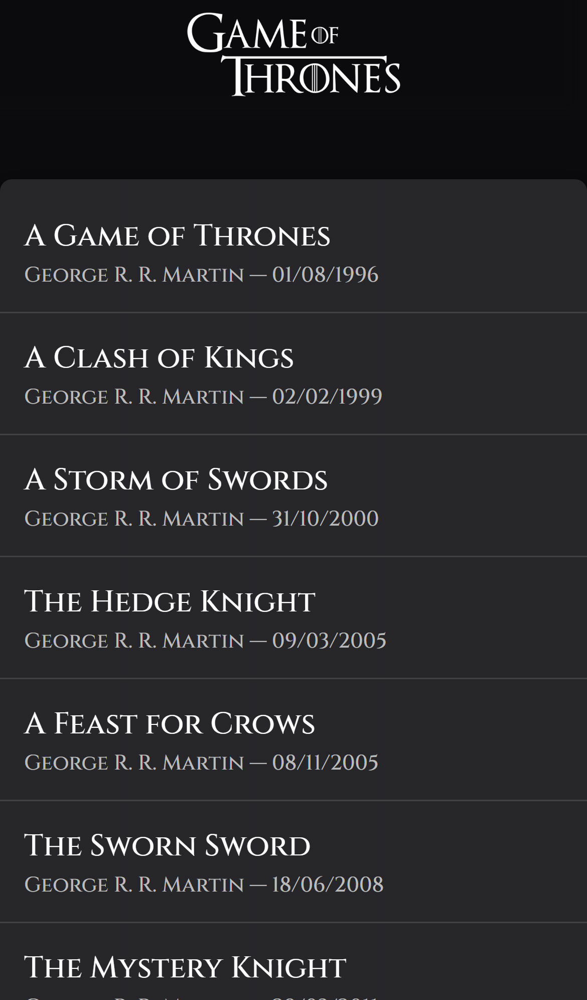

# A Song of Ice and Fire — Books

A small React app to browse the _A Song of Ice and Fire_ books and the characters that appear in
each of them, built on top of the public [An API of Ice and Fire](https://anapioficeandfire.com/)
API.


For the technical decisions behind this codebase, see [ARCHITECTURE.md](ARCHITECTURE.md).

## Features

- Browse the full list of books
- View a book's details: title, author, release date, page count, country, publisher and its
  characters
- Loading, error and empty states on every data-driven view
- Responsive layout (mobile, tablet, desktop) and keyboard/screen-reader accessible navigation

<table>
  <tr>
    <td></td>
    <td></td>
  </tr>
</table>

## Getting started

### Prerequisites

- Node.js 20+
- [pnpm](https://pnpm.io/)

### Installation

```bash
git clone git@github.com:BHocine21/anIhmOfIceAndFire.git
cd anIhmOfIceAndFire
pnpm install
```

### Development

```bash
pnpm dev
```

The app is served at `http://localhost:5173`.

## Available scripts

| Script                         | Description                                    |
| ------------------------------ | ---------------------------------------------- |
| `pnpm dev`                     | Start the Vite dev server                      |
| `pnpm build`                   | Type-check and build for production            |
| `pnpm preview`                 | Preview the production build locally           |
| `pnpm lint` / `lint:fix`       | Run ESLint                                     |
| `pnpm format` / `format:check` | Run Prettier                                   |
| `pnpm spell`                   | Run cspell on the codebase                     |
| `pnpm typecheck`               | Run the TypeScript compiler in check-only mode |
| `pnpm test`                    | Run unit tests (Jest + React Testing Library)  |
| `pnpm test:coverage`           | Run unit tests with coverage report            |
| `pnpm e2e`                     | Run Playwright end-to-end tests                |

## Testing

Unit tests live next to the code they cover (`*.test.ts(x)`) and run with Jest and React Testing
Library. End-to-end tests live in [e2e/](e2e/) and run with Playwright against a production build,
on both a desktop and a mobile viewport:

```bash
pnpm test
pnpm e2e
```

## Author

**Hocine Bouhlala** — Frontend developer (React/TypeScript)
[GitHub](https://github.com/BHocine21) · [LinkedIn](https://linkedin.com/in/hocine-bouhlala)
